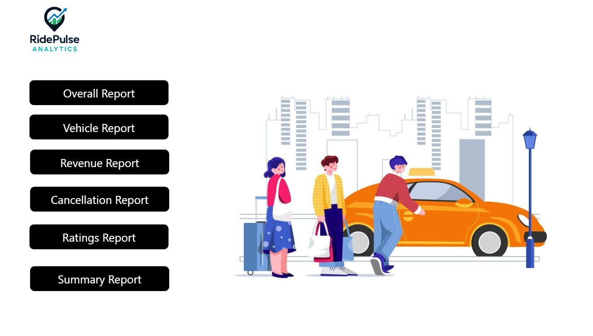
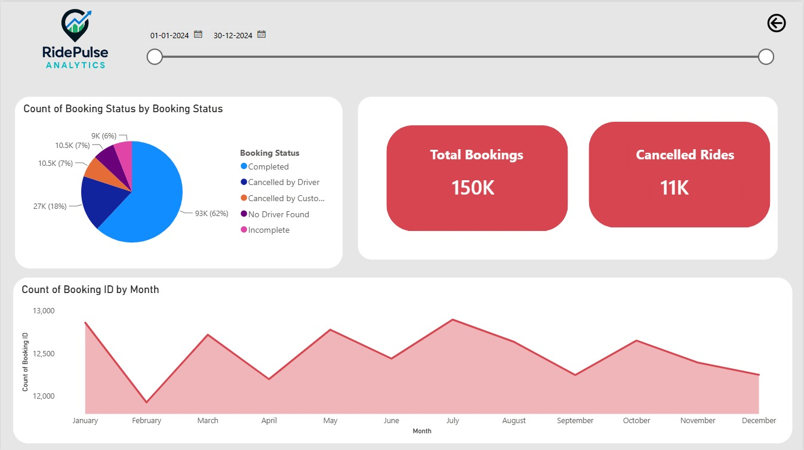
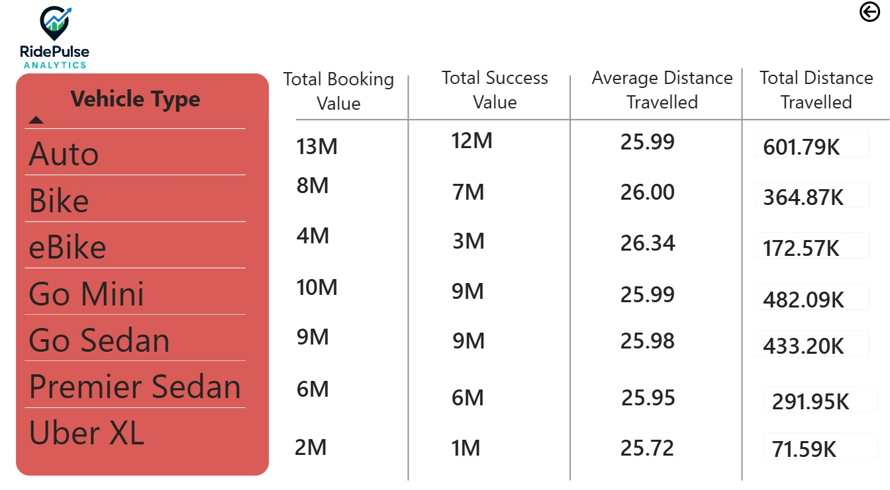
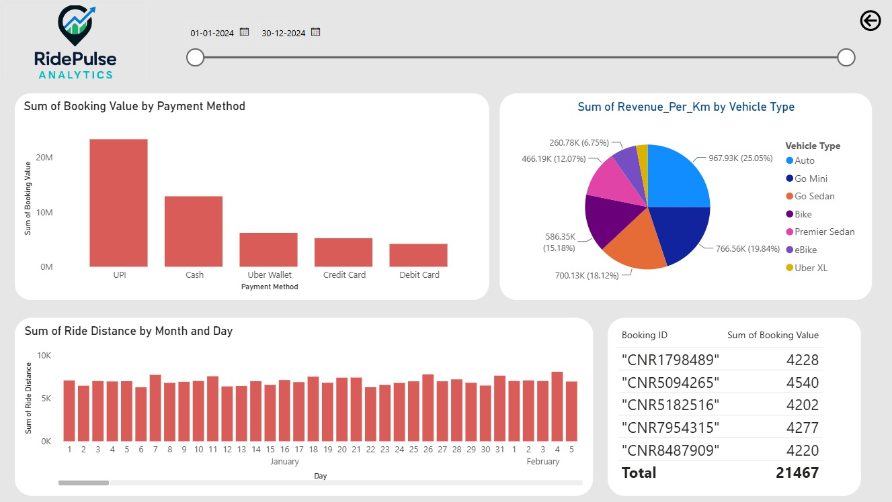
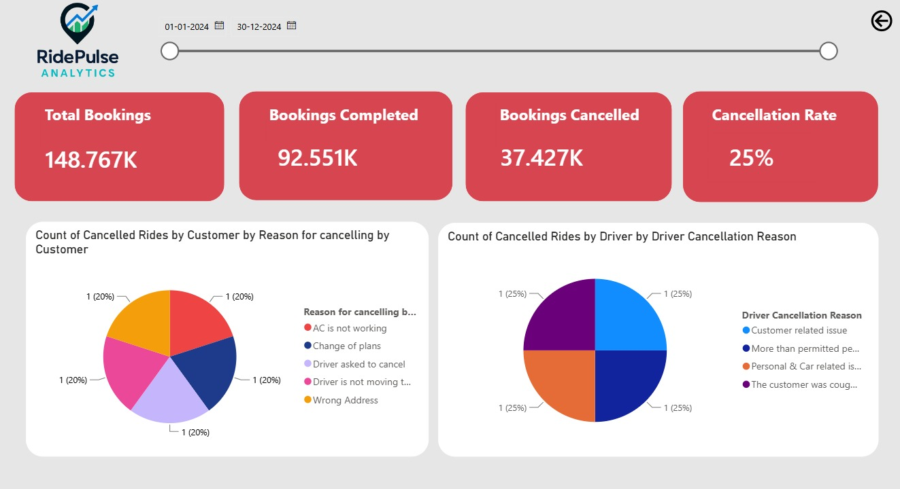
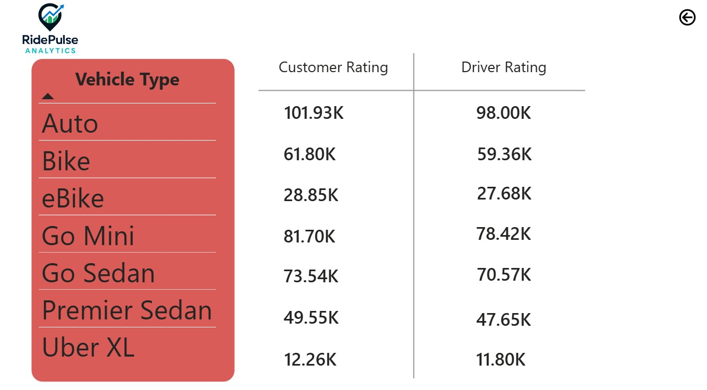
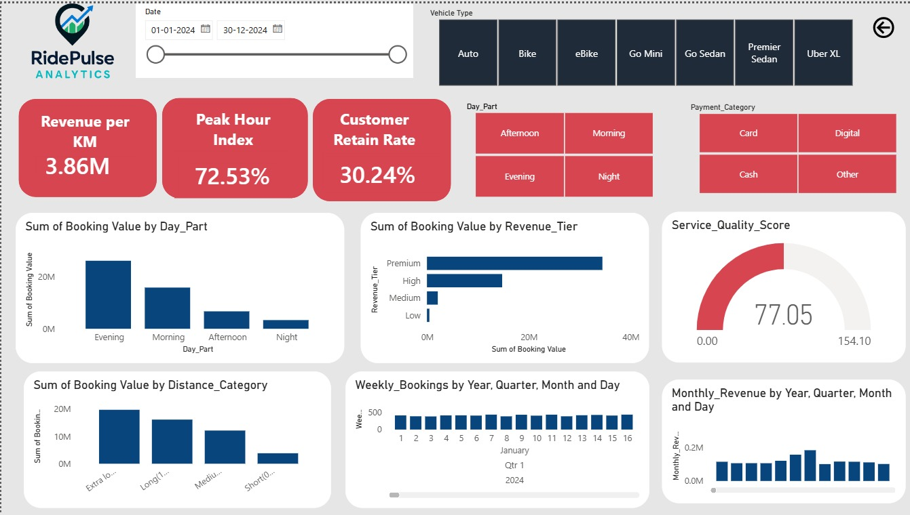

# 🚖 CityRide Analysis Dashboard | Power BI

## 🚀 Overview

This project is an interactive **Power BI dashboard** built to analyze CityRide's ride-booking operations using **Power BI Desktop**, **Power Query**, **DAX**, and **Data Modeling**. The dashboard transforms raw ride-booking data into meaningful business insights through KPI-driven visualizations and interactive reports.

It enables stakeholders to monitor booking trends, revenue performance, vehicle utilization, cancellation patterns, customer satisfaction, and operational efficiency, helping drive data-driven business decisions.

---

## 🎯 Objectives

- Analyze overall ride-booking performance
- Monitor booking and revenue trends
- Compare vehicle-wise performance
- Understand customer and driver cancellation patterns
- Evaluate customer and driver ratings
- Track operational KPIs
- Build an executive-level interactive dashboard

---

## 📸 Dashboard Screenshots

### 🚀 Home Page



### 📊 Overall Report




### 🚗 Vehicle Report



### 💰 Revenue Report



### ❌ Cancellation Report



### ⭐ Ratings Report



### 📈 Summary Report



---

## 📊 Key KPIs

- 🚖 Total Bookings
- ✅ Completed Bookings
- ❌ Cancelled Rides
- 💰 Total Revenue
- 📉 Cancellation Rate
- 📍 Revenue per KM
- 🚗 Average Ride Distance
- ⭐ Service Quality Score
- 👥 Customer Retention Rate
- ⏰ Premium Peak Hour Index
- 📅 Monthly Revenue
- 📈 Weekly Bookings

---

## 📈 Dashboard Features

- Interactive KPI Cards
- Booking Trend Analysis
- Revenue Analysis
- Vehicle Performance Comparison
- Revenue Tier Analysis
- Payment Method Analysis
- Customer & Driver Rating Analysis
- Cancellation Analysis
- Peak Hour Analysis
- Weekly & Monthly Performance Tracking
- Interactive Slicers & Filters

---

## 🧹 Data Cleaning & Transformation (Power Query)

The dataset was cleaned and transformed using **Power Query Editor** before building the dashboard.

### Transformations Performed

- Removed duplicate records
- Handled missing and null values
- Standardized categorical values
- Corrected inconsistent data types
- Created business-specific fields
- Optimized the data model for reporting

---

## 🧠 Business Logic (Calculated Columns)

### 👥 Customer Segment

Segments customers based on completed rides and total spending.

```DAX
Customer_Segment =
VAR TotalRides =
CALCULATE(
    COUNTROWS(rideBookings),
    ALLEXCEPT(rideBookings, rideBookings[Customer ID]),
    rideBookings[Booking Status] = "Completed"
)

VAR TotalSpend =
CALCULATE(
    SUM(rideBookings[Booking Value]),
    ALLEXCEPT(rideBookings, rideBookings[Customer ID]),
    rideBookings[Booking Status] = "Completed"
)

RETURN
SWITCH(
    TRUE(),
    TotalRides >= 30 && TotalSpend >= 3000, "VIP",
    TotalRides >= 15 && TotalSpend >= 1500, "Loyal",
    TotalRides >= 5 && TotalSpend >= 500, "Regular",
    "Occasional"
)
```

---

### 🚗 Driver Performance Category

Evaluates driver performance based on ratings and cancellation history.

```DAX
Driver_Performance_Category =
VAR DR = rideBookings[Driver Ratings]
VAR TotalDriverCancel = rideBookings[Cancelled Rides by Driver]

RETURN
SWITCH(
    TRUE(),
    DR >= 4.5 && TotalDriverCancel < 5, "Excellent",
    DR >= 4.0 && TotalDriverCancel < 10, "Good",
    DR >= 3.5 && TotalDriverCancel < 15, "Average",
    "Needs Improvement"
)
```

---

### ⏰ Peak Hour Detection

Identifies bookings occurring during peak demand hours.

```DAX
Is_Peak_Hour =
VAR Hour = HOUR(rideBookings[Time])

RETURN
IF(
    (Hour >= 6 && Hour <= 9) ||
    (Hour >= 17 && Hour <= 21),
    TRUE(),
    FALSE()
)
```

---

## 📊 Core DAX Measures
### ⭐ Service Quality Score

A composite KPI that evaluates the overall quality of the ride-booking service by combining **Driver Ratings**, **Ride Completion Rate**, and **Driver Cancellation Rate** into a single score.

```DAX
Service_Quality_Score =

VAR DriverRatingScore =
    DIVIDE(
        AVERAGE(rideBookings[Driver Ratings]),
        5,
        0
    )

VAR CompletionScore =
    VAR CompletedRides =
        CALCULATE(
            COUNTROWS(rideBookings),
            rideBookings[Booking Status] = "Completed"
        )

    VAR TotalRides =
        COUNTROWS(rideBookings)

    RETURN
        DIVIDE(
            CompletedRides,
            TotalRides,
            0
        )

VAR CancellationScore =
    VAR CancelledByDriver =
        CALCULATE(
            COUNTROWS(rideBookings),
            rideBookings[Booking Status] = "Cancelled by Driver"
        )

    VAR TotalRides =
        COUNTROWS(rideBookings)

    VAR CancellationRate =
        DIVIDE(
            CancelledByDriver,
            TotalRides,
            0
        )

    RETURN
        1 - CancellationRate

RETURN
(
    DriverRatingScore * 0.4 +
    CompletionScore * 0.3 +
    CancellationScore * 0.3
) * 100
```

---

### 📈 Revenue Momentum

Measures the percentage change between the current month's average booking value and the average booking value over the previous three months.

```DAX
Revenue_Momentum =

VAR Last3MonthsAvg =
CALCULATE(
    AVERAGE(rideBookings[Booking Value]),
    DATESINPERIOD(
        rideBookings[Date],
        MAX(rideBookings[Date]),
        -3,
        MONTH
    ),
    rideBookings[Booking Status] = "Completed"
)

VAR CurrentMonthAvg =
CALCULATE(
    AVERAGE(rideBookings[Booking Value]),
    rideBookings[Booking Status] = "Completed"
)

RETURN

DIVIDE(
    CurrentMonthAvg - Last3MonthsAvg,
    Last3MonthsAvg,
    0
) * 100
```

---

### ⏰ Premium Peak Hour Index

Compares the average booking value during peak hours against off-peak hours to measure revenue efficiency.

```DAX
Premium_Peak_Hour_Index =

VAR PeakHourRevenue =
CALCULATE(
    AVERAGE(rideBookings[Booking Value]),
    FILTER(
        rideBookings,
        VAR Hour = HOUR(rideBookings[Time])
        RETURN
            (Hour >= 6 && Hour <= 9) ||
            (Hour >= 17 && Hour <= 21)
    ),
    rideBookings[Booking Status] = "Completed"
)

VAR OffPeakHourRevenue =
CALCULATE(
    AVERAGE(rideBookings[Booking Value]),
    FILTER(
        rideBookings,
        VAR Hour = HOUR(rideBookings[Time])
        RETURN
            NOT(
                (Hour >= 6 && Hour <= 9) ||
                (Hour >= 17 && Hour <= 21)
            )
    ),
    rideBookings[Booking Status] = "Completed"
)

RETURN

DIVIDE(
    PeakHourRevenue - OffPeakHourRevenue,
    OffPeakHourRevenue,
    0
) * 100
```

---

## 📌 Additional DAX Measures

- 📅 Weekly Bookings
- 💰 Monthly Revenue
- 📊 Quarterly Average Booking Value
- ❌ Total Cancelled Rides
- 📍 Revenue per KM
- 🏷️ Revenue Tier
- ⏳ Days Since Last Ride

---

## 📊 Business Impact

- Built an executive-level dashboard for monitoring ride-booking operations.
- Enabled interactive analysis of booking, revenue, and cancellation trends.
- Identified customer behavior and driver performance using business-focused DAX calculations.
- Measured service quality through a composite KPI.
- Improved visibility into operational performance using interactive reports and drill-down analysis.

---

## 🛠️ Tools & Technologies

- 📊 Power BI Desktop
- 🔄 Power Query Editor
- 🧮 DAX (Data Analysis Expressions)
- 📐 Data Modeling
- 📈 Interactive Dashboards
- 📄 Microsoft Excel Dataset

---

## 📂 Repository Structure

```text
cityride-powerbi-dashboard
│
├── README.md
├── cityride project.pbix
├── cityride pdf.pdf
└── screenshots/
    ├── home-page.jpeg
    ├── overall-report.jpeg
    ├── vehicle-report.jpeg
    ├── revenue-report.jpeg
    ├── cancellation-report.jpeg
    ├── ratings-report.jpeg
    └── summary-report.jpeg

```

---

## 🚀 Getting Started

1. Clone this repository.
2. Open `CityRide-Analysis-Dashboard.pbix` using **Power BI Desktop**.
3. Refresh the dataset if required.
4. Explore the dashboard using the interactive filters and slicers.

---

## ⭐ Author

**Garvita Jain**

Built as a portfolio project to demonstrate practical skills in **Power BI**, **Power Query**, **DAX**, **Data Modeling**, and **Business Intelligence**.

---

## 📄 License

This project is shared for **educational and portfolio purposes**.

---

⭐ If you found this project useful, consider giving the repository a **Star**!
